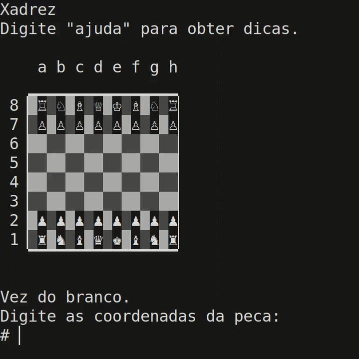

# Projects made with C

Board games and C libraries for cross-platform arena allocators, dynamic arrays, dynamic hash tables and linked-list based queues. The board games and queue library were written in portuguese.

The arena library uses OS APIs to reserve 256Mb of contiguous virtual memory without allocating physical memory pages unless necessary. Support for Windows and Linux has been tested, but other POSIX compliant operating systems should work out of the box. See arena.h for more information. 

The chess program implements checks, checkmates, promotions, en passant and castling.

The go program implements most of the japanese style rules, however I didn't implement seki.

