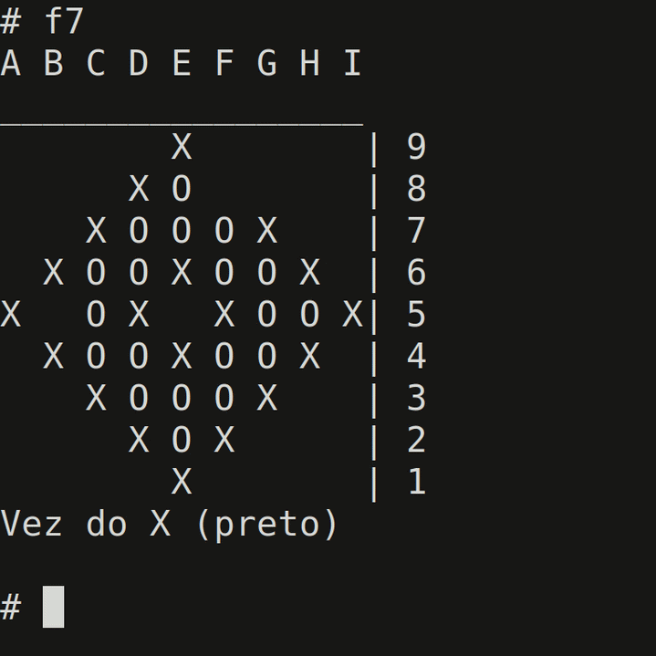
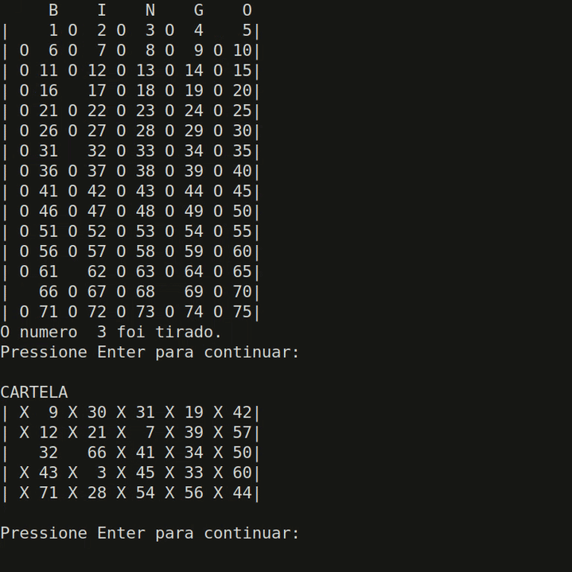

# Project made with C

Board games and c libraries for dynamic arrays and linked-list based queues. The board games and queue library were written in portuguese.

The chess program implements checks, checkmates, promotions, en passant and castling.

The go program implements most of the japanese style rules, however i didn't implement seki.

